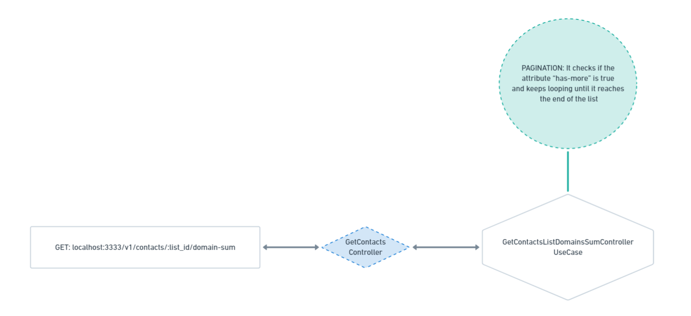

# Endpoint da API de integração com HubSpot 🚀


``
IMPORTANTE: Verifique o arquivo README.md para obter informações de execução do projeto
``

**GET**  este endpoint consulta a lista de contatos pelo `list_id` e lhe trará uma lista com os mesmos domínios de e-mail e sua respectiva quantidade.

```
/v1/contacts/:list_id/domain-sum
```

**Path variables**

|          Nome | Obrigatório |  Tipo   | Description                                                                                                                                                           |
| -------------:|:--------:|:-------:| --------------------------------------------------------------------------------------------------------------------------------------------------------------------- |
|     `list_id` | sim | number  | Preencha com o `list_id` da lista da qual você deseja buscar dados. <br/><br/> ``OBS:`` toda a vez que a aplicação se inicia, ela cria uma lista e exibe o List ID no console.                                                            | 

**Resposta**

```
[
    {
        "domain": "@meetup.com",
        "quantity": 15
    },
    {
        "domain": "@free.fr",
        "quantity": 29
    },
    {
        "domain": "@diigo.com",
        "quantity": 19
    }
]
```
### GetContactsListDomainSum


