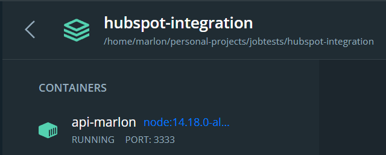
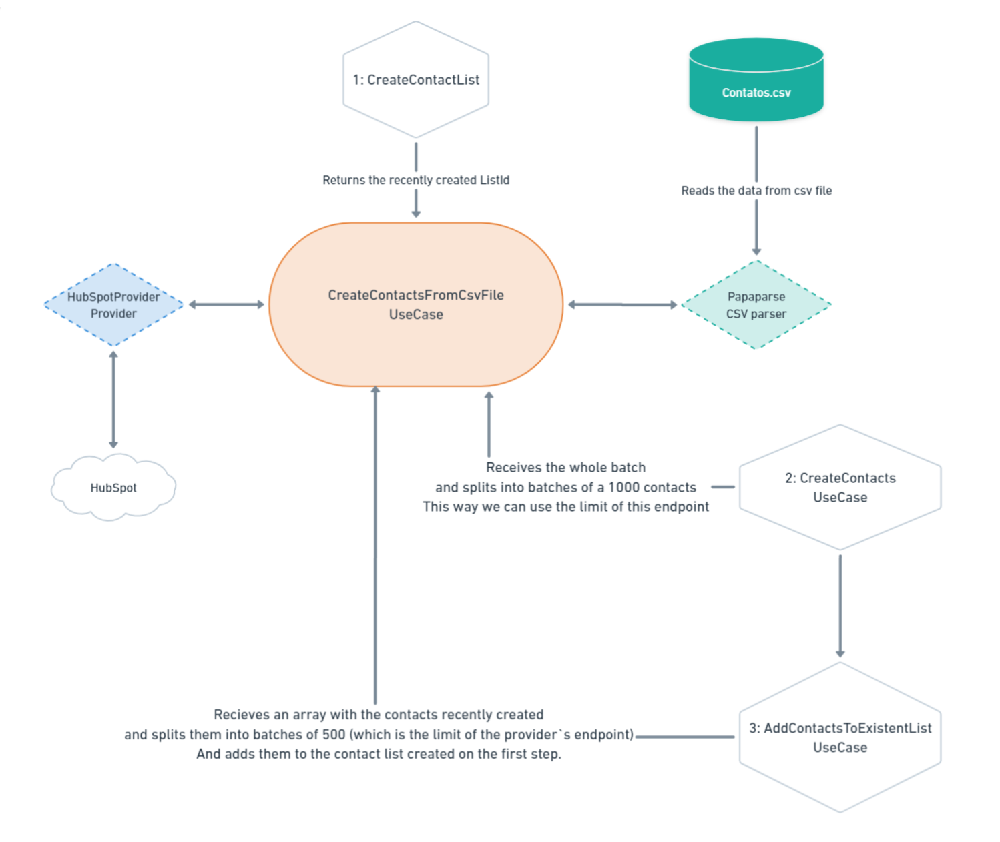

# API RESTful para integração com HubSpot

## Desenvolvida utilizando as tecnologias TypeScript, NodeJS, Express, Axios, Papaparse 🛠

[](https://www.typescriptlang.org/) [](https://nodejs.org/en/) 

Uma API RESTful que tem a função ler um arquivo csv com os contatos, no formato descrito abaixo, e registrar esses contatos em uma lista de contatos no HubSpot.

O projeto foi desenvolvido utilizando a arquitetura ou `design pattern` padrão `DDD`, aplicando os conceitos de `CleanArchture`, `CleanCode` e `SOLID`.

#### Requerimentos ✅

| Requerimento  | Uso |
| ------------- | -------------- |
| Yarn 1.1x     | Execução da aplicação e realização do deploy local |
| Docker 3.x    | Containerização e execução da aplicação |
| Node 14.8.x     | Executar a aplicação de forma local |

#### Requisitos do desafio ✅

| Status | Requisitos |
| ------------- | -------------- |
| ✅     | Criar uma lista de contatos no HubSpot ao iniciar a aplicação. |
| ✅    | Ler arquivo CSV e registrar os contatos da lista no HubSpot. |
| ✅    | Adicionar os contatos criados a Lista criada. |
| ✅ | REST Endpoint do tipo GET para obter a lista de domínios de e-mails iguais e sua respectiva quantidade. |
| ✅ | Paginação na obtenção de dados da API do HubSpot, para casos nos quais a lista possui mais de 100 contatos. |

### Variáveis de ambiente

| NOME | DESCRIÇÃO |
| --- | --- |
| APP_URL | URL que a aplicação irá ser executada. |
| APP_PORT | Porta que a aplicação ficará disponível. |
| HUBSPOT_API_URL | URL da API Legado do HubSpot. |
| HUBSPOT_API_KEY | Chave de acesso a API do HubSpot. |

#### OBS: Há um arquivo .env.example com os dados acima, basta preencher com os seus dados a executar a aplicação.

## Containerização da aplicação utilizando o Docker 🐳
[](https://docs.docker.com/)

#### 🔴 OBS: Recomendo fortemente utilizar o Docker para executar a aplicação por questões de performance

Após clonar o repositório, acesse a pasta via terminal e execute o seguinte comando:

```bash
yarn deploy:docker
```
ou
```bash
npm run deploy:docker
```
> Este comando no instala as dependências, cria uma build nova da aplicação, em seguida exclui o container do Docker caso exista e depois recria um container com a aplicação executando o Node.js de do container com a distribuição Alpine do linux.


> Após a execução o container hubspot-integration-marlon será criado no seu Docker

### Verificando se a aplicação está executando corretamente 🐳

Agora abra a sua aplicação do `Docker` e clique no container `hubspot-integration` ➡ `api-marlon`, e deverá ver os seguintes logs:



> Se tudo estiver executando perfeitamente os logs da imagem acima deverão ser exibidos.

## Execução da aplicação de forma local via terminal 🖥

```bash
yarn deploy
```
ou
```bash
npm run deploy
```

## Agora vamos direto ao Endpoint (badum tiss 🥁)

**GET** Consultar todos os resumos diários:

```
/api/integration/resumes
```
Ou consultar um resumo pela data: (AAAA-mm-dd)
```
/api/integration/resumes?date=2021-10-04
```
### Para obter a documentação da Api e clicar o endpoint no Postman basta clicar no botão abaixo:

[](./ENDPOINT.md)

## Use cases workflow

### CreateContactsFromCsvFile



## Entendendo a estrutura de pastas 🗂

### Pasta raiz do projeto 📁
```
    ├── .github        # Arquivos utilizados pelo GitHub
    ├── src            # Arquivos de Recursos da aplicação
    │   ├── modules    # Módulos da aplicação onde se encontrão os domínios
    │   └── shared     # Pasta com os recursos compartilhados entre os domínios
    └── ...
```

### Pasta de Modules 📁

```
├── modules          # Módulos da aplicação
│   └── contacts     # Módulo de contatos
└── ...
```

### Dentro de um módulo 📁

```
    ├── ...
    ├── contacts       # Módulo de contatos
    │   ├── infra         # Infra específico do módulo
    │   └── useCases      # UseCases com as regras de negócio do domínio
    └── ...
```

### Dentro da pasta infra de um módulo 📁

```
        ├── ...
        ├── infra                 # Infra específico do módulo
        │   └── http              # Recursos HTTP do domínio
        │       ├── controllers   # Controllers das requisições das rotas
        │       └── routes        # Configuração da rota de contatos
        └── ...
```

### Dentro da pasta shared 📁

```
  ├── ...
  ├── shared                  # Shared recursos compartilhados entre os domínios
  │   ├── containers          # Container com as injeções de dependências dos repositórios
  │   │   └── providers       # Providers compartilhados entre os módulos
  │   ├── errors              # Configuração de mensagens de erros retornadas
  │   └── infra               # Infra da aplicação como um todo
  │       ├── http            # Configurações HTTP da aplicação routes/server
  │          ├── app         # Instância da aplicação
  │          └── routes      # Instância de rotas de cada módulo da aplicação
  └── ...
```
